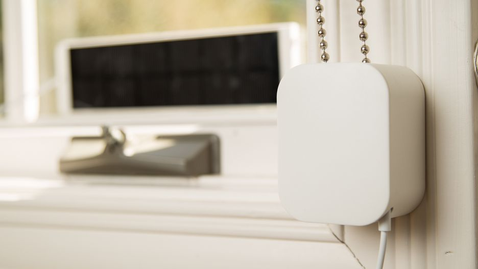
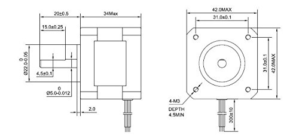
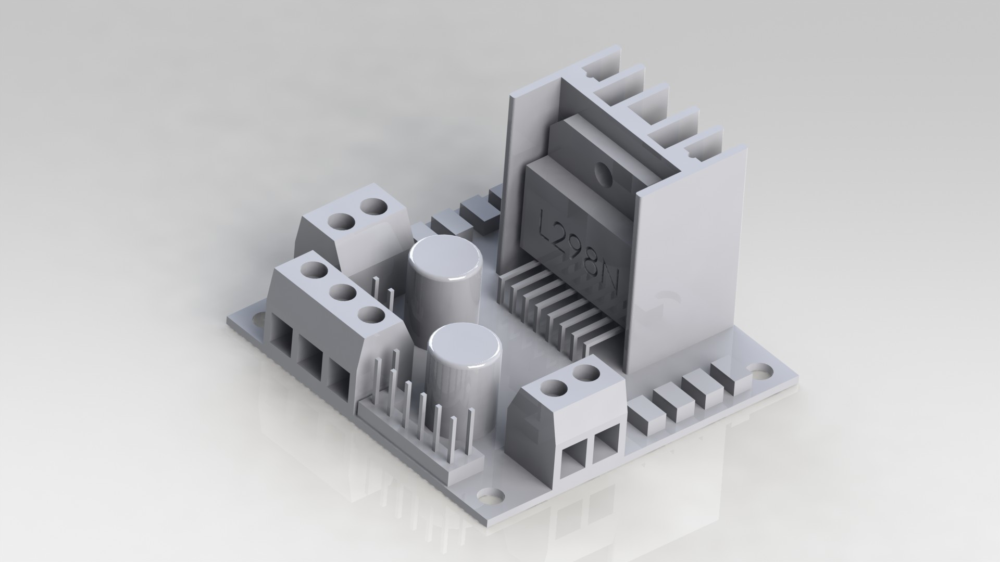
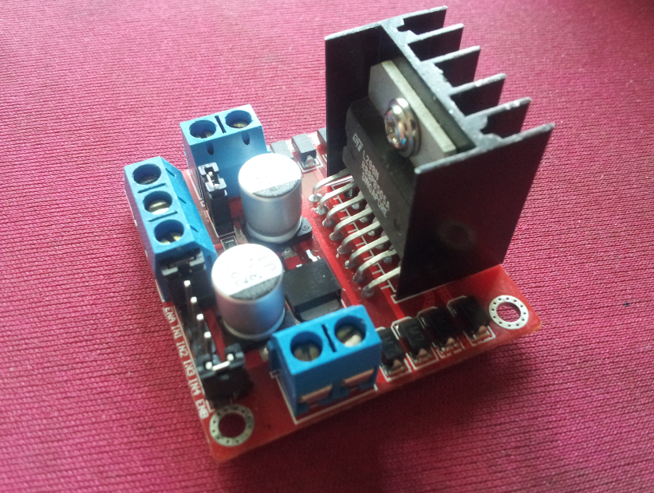
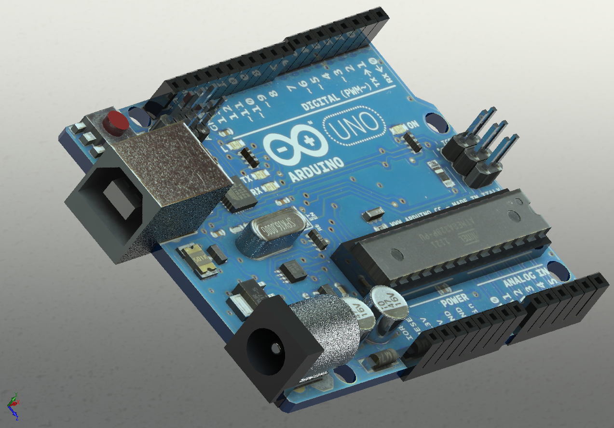
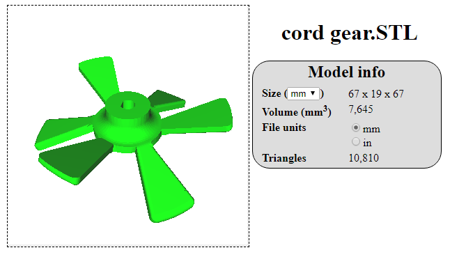
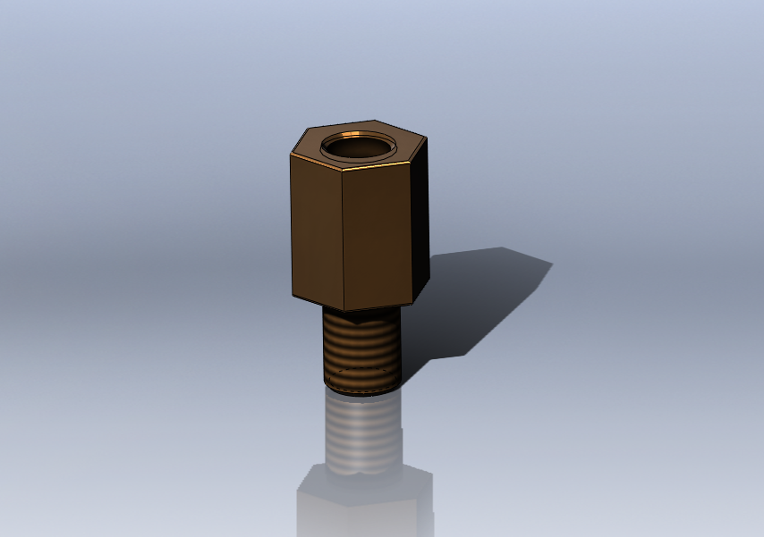
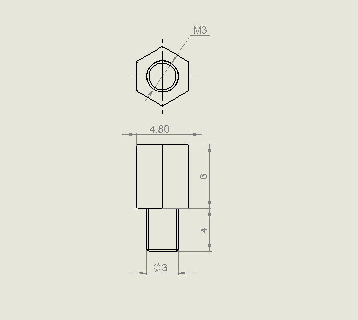
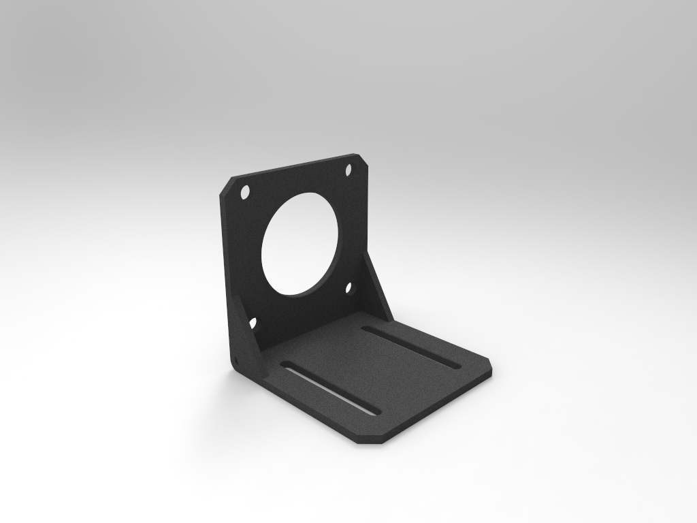
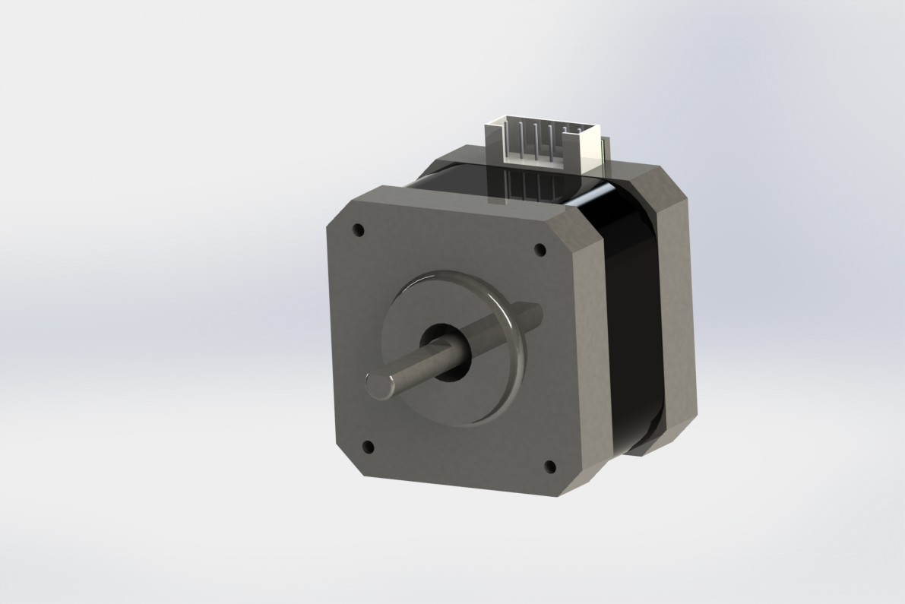

# smart-blinds
A blind that open closes at set time. 

Mechanical Design:

Figure 1 Dimension of the Smart-Blind System

- make the stepper motor's position adjustable
  - attach the motor to a flexible tube-like arm
- reduce blinds cord slippage
  - by using a vertical holder
  - by cutting out a "circle" of holes, allowing the l-bracket to be mounted at a variey of angles
  

Parts: 
| Tables        | CAD           | Picture  |
| ------------- |:-------------:| -----:|
| Arduino l298n |      |  |
| Arduino uno4     |      |        |
| Cord Gear |      |    |
| MotherBoard Scew |      |     |
| Nema stepper motor mounts|  |  |
|nema sepper motor mount| ||

mobile app:
1. Automatically determine opening and closing times based on location
2. Pair with the blind via bluetooth or wifi to set open or close time, and activate open or close action.

# Electric Circuit Design

powering arduino - options:
- barrel jack 7-12V regulated
- vin 7-12V regulated
- usb 5V unregulated

## scenario 1 - ideal, assuming motor is strong enough:
- my current 7.5v adapter with 1A
- motor controller and motor get power from arduino vin
- parts to order: motor, motor bracket, screws

## scenario 2 - 12V motor:
- will need a 12 V adapter with terminal block connector
- cannot use arduino jack and vin to transfer 12V power since too much current
- motor and motor controller will get power directly from source
- parts to order: motor, motor bracket, screws, 12V adapter, protoboard

# Components List (Cost)
- arduino uno: ~$15
- [sensor shield]: $13
- bluetooth module: $10
- motor controller: $14
- motor: $19
- motor bracket: $10
- 12V adapter: $14
- protoboard: $0.30

- acrylic board
- screws, standoffs, etc.
- motor attachments
